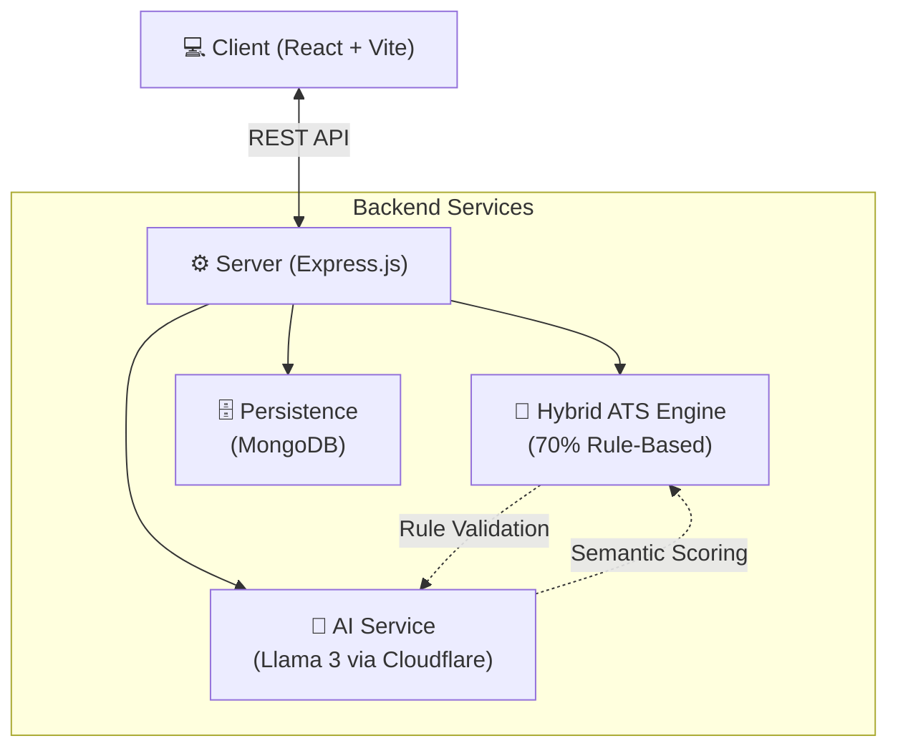

<div align="center">
  

  <a href="https://git.io/typing-svg">
    
  </a>

  <p align="center">
    <b>Bridge the gap between candidate resumes and modern Applicant Tracking Systems.</b>
  </p>

  <div>
    
    
    
    
    
    
  </div>
</div>

<br/>

HireScope is an AI-powered Hybrid ATS Analyzer and Career Intelligence platform designed to bridge the gap between candidate resumes and modern Applicant Tracking Systems. By combining deterministic rule-based analysis with advanced large language models, HireScope provides high-precision scoring and surgical resume optimization.

---

## 🚀 The Hybrid Engine Advantage

Traditional ATS scanners often rely on simple keyword matching, leading to high false-negative rates. HireScope utilizes a **70/30 Hybrid Scoring Architecture**:

- ⚙️ **Rule-Based Analysis (70%)**: Deterministic checks for structural integrity, contact information validation, experience years calculation, and exact keyword matching. This ensures baseline ATS compliance.
- 🧠 **LLM-Powered Intelligence (30%)**: Semantic similarity matching, role alignment scoring, and contextual skill detection using **Llama 3**. This captures the "intent" and "quality" of experience that simple scanners miss.

## 🏗️ System Architecture

GitHub natively renders this architecture flow!



## ✨ Core Features

* 📄 **Intelligent Resume Parsing**: Support for PDF and DOCX formats with advanced text extraction.
* 📊 **Deep ATS Analytics**: Actionable UI showing Score Deltas, Knockout Factors, Missing Critical Skills, and detailed formatting alerts.
* 🪄 **Magic Improve (Dual-Mode Optimization)**:
  * **Optimize Content (Structured)**: Surgical updates that preserve your original resume structure and headers while improving wording and keyword density.
  * **Regenerate Resume (Experimental)**: Full AI-powered rewrite for radical JD alignment (best for significant career pivots).
* 🛡️ **Structured Validation**: Defensive layers that prevent the AI from fabricating experience or altering document structure during enhancement.

## 📈 ATS Scoring Breakdown

| Component | Weight | Description |
| :--- | :---: | :--- |
| **Experience Mastery** | 20% | Validation of years of experience against JD requirements. |
| **Core Skill Match** | 15% | Direct keyword matching of essential technical skills. |
| **Semantic Alignment** | 15% | Contextual similarity between resume bullets and JD responsibilities. |
| **Contact Integrity** | 10% | Verification of essential contact details (Email, Phone, LinkedIn). |
| **Skill Density** | 10% | Overall ratio of relevant industry keywords. |
| **Structural Health** | 10% | ATS-friendly formatting and section header identification. |
| **Summary Impact** | 10% | Qualitative analysis of the professional profile. |
| **Risk Assessment** | 10% | Identification of gaps, weak verbs, or missing quantification. |

<br/>

## 🛠️ Getting Started

<details>
<summary><b>Click to expand setup instructions</b></summary>

### Prerequisites

- Node.js (v18 or higher)
- MongoDB Atlas or local instance
- Cloudflare AI API access (or configured Llama 3 provider)

### 1. Installation

```bash
# Clone the repository
git clone https://github.com/Codegarg/HireScope.git
cd HireScope
```

### 2. Backend Setup

```bash
cd server
npm install
```
Create a `.env` file in the `server` directory:
```env
PORT=5000
MONGODB_URI=your_mongodb_connection_string
JWT_SECRET=your_jwt_secret
CLOUDFLARE_API_TOKEN=your_token
CLOUDFLARE_ACCOUNT_ID=your_account_id
```

### 3. Frontend Setup

```bash
cd ../client
npm install
```
Create a `.env` file in the `client` directory:
```env
VITE_API_BASE_URL=http://localhost:5000/api
```

### 4. Running Locally

You'll need two terminals to run the app:

**Terminal 1 (Backend)**:
```bash
cd server
npm run dev
```

**Terminal 2 (Frontend)**:
```bash
cd client
npm run dev
```
</details>

## 📡 API Overview (AI Improvement)

```http
POST /api/resumes/:id/improve
```

<details>
<summary><b>View API Payload & Response</b></summary>

### Request
```json
{
  "resumeText": "...",
  "jobDescription": "...",
  "mode": "structured",
  "previousScore": 72
}
```

### Response
```json
{
  "success": true,
  "optimizedResume": "...",
  "improvementSummary": [
    "Replaced 'Worked on' with 'Spearheaded' in Experience section",
    "Quantified project impact by 25% efficiency increase",
    "Inserted 'Kubernetes' into Technical Skills"
  ],
  "newScore": 88,
  "scoreDelta": 16,
  "llmFallback": false
}
```
</details>

## 🗺️ Roadmap

- [ ] Interactive Resume Heatmaps for Skill Density
- [ ] Multi-document Resume Comparison
- [ ] Automated Cover Letter Generator based on ATS Scores
- [ ] Browser Extension for direct LinkedIn job analysis

## 📜 License

This project is licensed under the MIT License - see the [LICENSE](LICENSE) file for details.

## 👨‍💻 Author

**[Ridham Garg](https://github.com/Codegarg)**
*Founder / Lead Architect*

<div align="center">
  
</div>